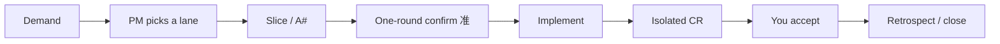

# ai-gates

中文 → [README.md](./README.md)

**AI can dump a pile of bad code in seconds. That is why you need gates: you state the demand in your native language; routing, slicing, review, and acceptance stay in the pipeline—lower cognitive load, not a lower quality bar. It is done only after you have tested it.**

The flow of vibe coding is: skip syntax, skip the docs, skip a complete architecture up front, and build the code by feel, like drawing. ai-gates is the most graceful balance we have so far between engineering governance and natural interaction—it does not buy safety by interrupting you; it uses low-perception guardrails so you can keep moving. That is the bridge from vibe coding as a toy to vibe coding that is production-usable.

You are not forced to drop the vibe, and you are not left naked in it. Day to day you only reply `准`: understand + plan + start, one confirmation. After that, Standard/Full may Auto-run implement↔review until a hard stop or wait-for-accept—black-box speed while you stay in flow. The main chat stays the project manager; coding and review sit in sub-sessions, so the flow thread is not flooded with diffs. When you need safety, open the doc window and the box turns white (Express/Direct may skip a folder). Vibe coding’s real fear is not “it wrote it wrong,” but “it wrote it wrong and you only find out in production.” The folder is the power to crack the black box white whenever you actually need to know what changed and why.

## Distinctive mechanisms

A few things already running here that are uncommon elsewhere. Not a feature list.

- **Delivery loop**: one folder per demand; when it ends it must leave In Progress (signed off / failed). Once a small change already has a folder, it must still leave In Progress after a test or if no one claims it—you cannot park it on “not tested yet.” Reply `准` (`approve`) = understand + plan + start, one confirmation. Finish means close out, not just flip a status word.
- **Lessons loop**: see the shared allusion “never the same mistake twice.” A failed test writes L0 → a fix drafts pending → your `准` promotes it to the project table → the next planner must read it → a hit raises the review tier. Failures become rules, not chat logs. Allusions compress a verified structure into one word so the same structural pit is not retold.
- **It grows**: users everywhere evolve the skill together. Every AI mistake and every verified structure is a chance to grow—reply `准` to keep a project-local lesson or allusion; say “upload” separately (and have GitHub CLI signed in on this machine) to send de-identified entries to the public collect repo ([ai-gates-collect](https://github.com/zhaobolun-code/ai-gates-collect)): anyone can open a branch and file a pull request; merging needs permission. A merge in the collect repo is not your pack updating. After maintainers pull it into the skill source, say `项目经理 升级 ai-gates` to take what the world has already grown. Not frozen at install, and not auto-rewriting rules.
- **Task routing**: the PM assigns models by task—light edits at the lowest tier, planning/implementation at the normal tier, code review and acceptance at the high tier. Rough relative cost (not a bill; lowest 1 ∶ normal 2 ∶ high 8): a Standard window (plan + plan review + implement + isolated CR + accept) all on the high tier ≈ 40, routed ≈ 22, about 40–50% less high-tier spend. Collision review / reverse-chain are unusual procedures, on by name only, not part of a lane, not counted in everyday window cost.
- **Stop-loss loop**: the same approach failing repeatedly is sealed and rerouted; the dead end is recorded. No infinite small patches.

The rule layer works on every platform; where machine hooks actually deny is under Platform below. 30-second install, 3-minute fluency; acceptance stays with you.

## Positioning: a project manager for AI coding

Most tools focus on the code itself. ai-gates adds a layer—order in the whole development process (align demand → confirm a plan → execute → accept → retrospect → stop-loss). Repeated failures auto-promote into rules. Why it is designed this way, and real outcome data: [METHODOLOGY.md](https://github.com/zhaobolun-code/ai-gates/blob/main/.ai-gates/METHODOLOGY.md).

## What it treats (why it helps)

Classic vibe coding offloads cognitive load—and then these four things blow up together. With ai-gates vs without:

| | Without ai-gates | With ai-gates |
| --- | --- | --- |
| **Quality is uncontrolled** | Green logs or the model reviewing itself counts as fixed | Acceptance A#, isolated CR, split-model review; done only when you see the phenomenon |
| **Debt piles up fast** | The same mistake again, infinite small patches | Lessons, allusions, stop-loss, physical constraints (no scene-specific hacks) |
| **Dependencies tangle** | Grab libraries, copy foreign repos, scope grows in silence | Read this repo first, choose existing structure, foreign repos for structure only, Delta against silent scope creep |
| **A tiny change avalanches** | A large change still forced through as a small one | Four lanes (more files / cross-module → promote immediately), **heat** (failed modules get a stronger review next time), regression index, stop-loss |

Guardrails scale in the background by risk: **heat** only strengthens review already on Standard; it does not promote a lane by itself. Black in the moment: one-round confirm, Auto, sub-sessions. White after the fact: the doc window. Day to day you still see one “your next step.” Safety without interrupting you.

## 30-second install, 3-minute fluency

Path A hands install to one paste. After that you do not memorize the mechanism table. Everyday work is three steps: state the demand, reply `准`, accept against the prompt.

### Path A (recommended · zero manual · same paste on every platform)

Paste the **whole** block to the Agent. It will fetch the latest release, install the library, create portals, and walk init:

```text
Install ai-gates (the AI development pipeline skill pack) from https://github.com/zhaobolun-code/ai-gates into this project, replacing manual download, unzip, and init:
- Take the latest release tag; clone/download to a temp dir; require a root .ai-gates/ whose skills/VERSION is a legal x.y.z equal to that tag, or stop.
- Copy temp .ai-gates/ skills/hooks/scripts/rules/codex, root docs, hooks.json, link-platform.*, LICENSE into project-root .ai-gates/; if already installed, compare versions and replace only on update; keep project-context, mcp.json, hooks-log, tmp, verify, regression-*, pipeline-* and other project state.
- Run link-platform.ps1 (Unix: .sh) to create portals; write install-info.json.
- Run pm-init.ps1; saying 「项目经理 初始化」 is enough to start (regression index can come later) and generate .cursor/project-context.md.
- Then report version and portal status, and tell me the later entry is 「项目经理 + 需求」.
List a plan and wait for my confirm before touching files; on failure or network issues do not change files—give a manual download path.
```

### Per-platform quickstart (after install)

| Platform | How you start |
| --- | --- |
| **Cursor Agent** | New Agent chat → paste 「项目经理 + 需求」; portals: `link-platform.ps1` / `.sh` |
| **Codex CLI** | `codex` at project root (hooks must be trusted) → same phrase; CLI hooks have been measured to deny |
| **Codex Desktop** | New session → trust project hooks → 「项目经理 + 需求」; the `apply_patch` hook may not fire → after writes, check `.ai-gates/hooks-log/` |
| **Trae** | New session → 「项目经理 + 需求」; rules + skill portals only, **no machine hooks** |
| **Claude Code** | Session at project root → approve hooks/MCP → 「项目经理 + 需求」; hooks confirmed on a real machine 2026-08-10 |

**Onboard**: in a new repo say `项目经理 初始化`. The assistant writes the project note and probes the stack; the regression index can wait—you can start without it. CodeGraph is optional. Details / blocked? → [USER-GUIDE.md](https://github.com/zhaobolun-code/ai-gates/blob/main/.ai-gates/USER-GUIDE.md). Health check: `项目经理 检查健康`. Design: [METHODOLOGY.md](https://github.com/zhaobolun-code/ai-gates/blob/main/.ai-gates/METHODOLOGY.md); changes: [CHANGELOG.md](https://github.com/zhaobolun-code/ai-gates/blob/main/.ai-gates/CHANGELOG.md).

## Workflow: one demand, end to end



Lanes only change how coarse each step is (Express may skip an independent CR; Direct slices in chat with no disk file; Standard/Full plan-review first). You only say what you want:

**Demand → `[PM]` lane → slice (what changes / what counts as pass) → one-round confirm (`准`) → implement → isolated code review → accept → retrospect (failures into lessons) → close**

| Lane | What it looks like |
| --- | --- |
| **Express** (exactly 1 file: comment / copy / constant) | One-sentence slice → confirm → edit → one-line self-check; no independent CR. No folder on everyday work; if a folder was created, it must be moved on close |
| **Direct** (default: behavior change or 2–3 files) | A# / slice in chat (not on disk) → confirm → edit → isolated CR |
| **Standard** (>3 files / cross-module / API / persistence / unclear) | plan-lite first → plan review → confirm → edit → isolated CR |
| **Full** (user asked for the full process, or stop-loss already on Standard) | execution doc → plan review → confirm → edit → two-round raised-model review |

Every step is accepted—A# writes “what counts as pass” in advance; your eyes are the source of truth. If files grow or you hit API / persistence / cross-module, re-lane immediately; do not force it. **Heat** only strengthens review already on Standard; it does not change the lane by itself. Simple or urgent small edits take Express / Direct (one-sentence slice, no everyday disk file, no extra ceremony)—gates scale with risk, they do not tax small edits. Once a folder exists, it still must be moved after a test or if no one claims it.

## What is inside (mechanism table)

These are guardrails, not a feature list—each maps to a failure mode already hit in real edits. **You do not memorize this table for everyday use.**

| Mechanism | What it does |
| --- | --- |
| **Regression index + heat** | Editing a module/file that failed before, **already on Standard**, raises review (L1.5; a heat hit takes the higher tier: plan review L3 / two-round CR). Does not promote Express/Direct into Standard by itself. Past failures raise the review line; nobody has to remember |
| **Machine enforcement** | Dangerous git (`push --force`, etc.) and writes without a fresh PM decision are denied by hooks—not a prompt (measured on Codex CLI and Claude Code; Codex Desktop has a known gap—check hooks-log) |
| **Four lanes** | Express / Direct / Standard / Full auto-judged (Direct skips disk; you can still force Full with “full process”); a hit mid-flight re-lanes immediately |
| **Stop-loss** | Same approach failing repeatedly → forced re-scope / A# reconsider; no infinite small patches |
| **Slice first** | Even a small edit gets a slice (what / pass criteria), one slice at a time; out of scope stops |
| **Review gates (tiered)** | When the lane requires it: plan review must pass before start; a CR blocker is not a freeze (Express/Direct may skip plan review; Direct still needs isolated CR). Review rises with risk: regression module L1.5, cross-module L2, Full L3, heat hit → plan review L3 / two-round CR, high-risk may use adversarial review. L1.5 defaults to spec + convention axes; review does not re-run tests the implementer already reported; an Agent claiming it tested must include the command |
| **One-round confirm** | One confirm pack per decision (`准`); no silent start of code or review |
| **Grill clarify** | When the demand is unset (vague / large / still split after several clarifies), one question at a time until design branches are closed; questions carry a recommended answer; the board is still one `准` (demand-clarification §grill) |
| **Harness + Auto** | In-session gates bind the Agent; Standard/Full after `准` may run implement↔CR until a hard stop or wait-for-accept (Express/Direct do not enable Auto) |
| **Recovery phrase** | Chaos / off-process → `按 CORE 重来` returns to the pipeline; wrong code → `方案推翻` after confirm, then revert |
| **Roles** | PM dispatches planner / developer / CR / docs; keep the main chat as PM |
| **Sub-sessions** | Implement and review prefer isolated sub-sessions so the main chat stays PM—avoid one giant thread |
| **Implementer four-state** | The coding sub-session first reports done / concerns / stuck / missing context; Standard/Full without that line do not dispatch review. Express still uses a one-line self-check, no four-state |
| **Split-model review** | Three routing tiers: light edits lowest, plan/implement normal, CR and accept high (project-configurable)—do not let implement and review share one cheap model |
| **Doc window** | One folder per task (plan / physical constraints / evidence / done), filed by state. Express has no everyday window; if a folder is created it needs a slice + self-check and must be moved on close |
| **Cross-session ledger** | Standard/Full, before continuing in a new chat, reconcile the ledger; completed steps must not be re-dispatched. Express/Direct have no ledger |
| **Physical constraints** | Hard constraints + negative constraints + fail criteria (Standard/Full task windows) |
| **Blackboard** | This window’s fail log: what changed → why it failed → do not do that again |
| **Lessons** | Cross-window lessons; auto-drafted, **your `准` required** before the project table. Goal: shared allusion “never the same mistake twice” |
| **Allusion guardrails** | A registered allusion word recalls the whole consensus (shared-language dictionary; silent redefinition forbidden); survives model/people changes. With lessons, same allusion |
| **It grows** | Grow together: `准` keeps project-local lessons/allusions (`准` ≠ upload); public collect repo is open—say “upload” and have GitHub CLI signed in to open a branch PR to [ai-gates-collect](https://github.com/zhaobolun-code/ai-gates-collect) (merge needs permission ≠ shipped). `项目经理 升级 ai-gates` pulls skill source. Every AI mistake is a chance. Not auto-rewriting rules, not a seventh role |
| **Foreign-repo compare** | When this repo has no peer, the PM may hint; you name “外仓对照” before any public-repo search. No copying foreign code. A hint ≠ already compared |
| **Delta Spec** | Each step tracks ADDED / MODIFIED / REMOVED against silent scope growth |
| **Acceptance A#** | Falsifiable criteria per step. “The log printed a keyword” ≠ fixed. Hitting a regression module auto-runs smoke and files logs/screenshots/reports—auto-verify ≠ hand-test sign-off |
| **Replayable asserts (TDD)** | External dotnet NUnit at repo root (e.g. `Tests/EditMode/`) as a regression line: after business edits, trx all-green (total≥70 and failed=0) to pass; green asserts ≠ business pass, hand-test still applies; if this Step’s accept includes mechanically checkable items → write asserts first by default (test-first on unless the plan/PM forces otherwise) |
| **File portals** | Cursor / Codex / Trae / Claude Code share one central library via portals (link-platform); one edit applies on all platforms—stops four copies drifting |

## Platform

- **All platforms (rules / skills / portals)**: rules are plain Markdown; other Agents can adapt. Portal scripts are **dual**—Windows `link-platform.ps1`, macOS/Linux `link-platform.sh` (Trae also has `link-trae-skills.sh`); all create `.cursor/*`, `.codex`, `.claude`, `.trae/skills`, `.trae/rules`.
- **Cursor / Codex / Trae / Claude Code share one library**: one `link-platform` run creates every portal.
- **Windows: full support**. Machine hooks (PM write gate / dangerous git deny / Unity compile hint, all `.ps1`) have been measured to deny on Codex CLI 0.146/0.147 and Claude Code (real-machine 2026-08-10). One-paste install: “30-second install, 3-minute fluency.” Known gap: Codex Desktop may not fire the `apply_patch` hook (trust approved, still zero marks)—after critical writes, check `.ai-gates/hooks-log/`.
- **macOS / Linux (hard prerequisite)**: install, rules, skills, portals all work (`bash .ai-gates/link-platform.sh`). Machine hooks are **all `.ps1`**—for deny to actually block, this machine needs **PowerShell 7+ (`pwsh`)** and the Agent/hooks must be able to call it; **no `pwsh` = rule layer only, hooks are not wired** (do not claim machine gates are on). No bash hooks yet.
- **Trae is the soft layer**: rules + skill portals are complete, but no machine hooks—gates apply as rules; machine force is not covered.
- **Single-repo boundary**: gates are this repo; cross-repo (multi-repo / microservices) edits are outside machine force and stay a team convention.

## Prerequisites

- Any Agent session that can edit files (Agent and OS coverage: Platform above)
- One `项目经理 初始化` (regression index can wait; the pack **does not** ship someone else’s task windows or CHANGELOG)

## You only do three things

1. **State the demand**: say 「项目经理 + 需求」(`项目经理` = `PM`)
2. **Confirm**: read “your next step”, reply `准` (`approve`)
3. **Accept**: test once as prompted, reply pass / fail

Everything else is relayed by role. What the pipeline does vs what you see:

| Inside the pipeline | What you see |
| --- | --- |
| Judge size, pick a lane | One “your next step” |
| Write the plan / execution doc (planner) | A confirm note; reply `准` |
| Implement to the plan (developer) | Progress |
| Isolated code review (code-reviewer) | A short review |
| Auto-verify + evidence | A test plan |
| Retrospect, failed work into lessons | Auto-draft; `准` when asked |
| Close: sign off, move the folder | You say “pass” and it is done |

The mechanism table is a **guardrail legend**, not a checklist before you start; the assistant runs the gates. Blocked? The deny text includes an escape. Full lookup: the USER-GUIDE link under “30-second install, 3-minute fluency.”
